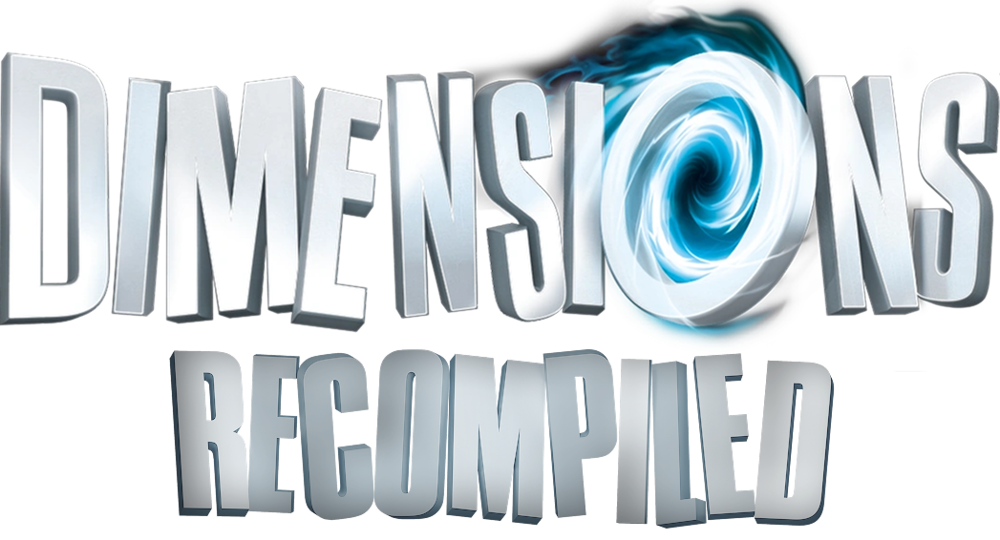

<p align="center">
  
</p>

<p align="center">
  A native PC build of LEGO Dimensions, made by statically recompiling the Xbox 360 release.
</p>

<p align="center">
  <a href="https://github.com/NeverCookFirst/DimensionsRecomp/releases/latest"><b>Download</b></a>
  &nbsp;&middot;&nbsp;
  <a href="docs/how-to-mod.md">How to make Mods</a>
  &nbsp;&middot;&nbsp;
  <a href="README-dev.md">Build it yourself</a>
  &nbsp;&middot;&nbsp;
  <a href="https://discord.com/invite/PuXpBMFE4P">LEGO Dimensions Discord</a>
</p>

---

## Why this exists

I started this to answer one question: can a toys-to-life game be recompiled, and
is a native PC port of LEGO Dimensions actually realistic?

The answer is yes, and this is the proof. It boots, plays, saves, loads DLC, and
talks to a Toy Pad, as a normal Windows program.

This is not a claim to be the one correct way to play on PC. Emulation works, and
the emulator projects did the groundwork that made this possible. If
[xenia](https://github.com/xenia-canary/xenia-canary),
[RPCS3](https://github.com/RPCS3/rpcs3), [Cemu](https://github.com/cemu-project/cemu) or [shadPS4](https://github.com/shadps4-emu/shadps4) serves you better, use them. I respect
every project around this game and none of them are competitors.

There is a second reason, and it matters to me more than the first one. I want
this to make someone else want to build something. If it gets one person curious
enough to open a disassembler for the first time, it has already paid for itself.

So, to be blunt about what this is not: it is not a claim on the idea. Nobody's
LEGO Dimensions port is blocked because this one exists. If a team gets together
tomorrow and writes a better one from scratch, without using a single byte of
what is here, that is exactly the outcome I was after and I will say so happily.
Take the idea, ignore the code, do it properly.

And whatever you end up building — respect what other people are working on.

## How Claude was used

I would rather you hear this from me than guess.

> [!WARNING]
> [Claude](https://claude.ai) was used heavily as a development tool. It read
disassembly and file formats with me, and wrote large parts of the runtime glue,
the installer, the mod tooling and this page.

**What it did not do** is decide what to build or judge whether the result was any
good. The goal and the scope were mine. The domain knowledge about this game,
its Toy Pad, its saves and its archives came from years of community work, not
from a model. And above all I played the game. Every "this is broken", "this
feels off" and "this is finally right" came from a person in front of the actual
thing. A model cannot tell you a world failed to load or a cutscene hung. That
loop is what turned something that compiled into something that plays.

If you are skeptical about AI being used this way, that is fair and I will not
argue with you. Judge it by whether it works.

## Install

**No game data is included here.** You bring your own, and the installer checks
that it is the right one before it does anything.

Have ready:

- **The Xbox 360 disc, dumped and extracted.** Dump your disc to an ISO, then
  extract that ISO to a folder with a tool like
  [extract-xiso](https://github.com/XboxDev/extract-xiso) or Xbox Image Browser.
  The installer wants **the folder, not the ISO**. It is right when the folder
  contains `Default.xex` alongside `GAME.DAT` and `GAME.HDR`. Only the original
  release works, and the installer will tell you if yours is a different build.

- **Title Update 23. Not 24, not 22.** The recomp was built from the TU23
  executable and will not run on anything else, so this one is checked by hash
  and a wrong update is refused. Give it either the raw package file, which is
  named `tu00000003_00000000` and has no extension, or a folder holding
  `Default.xexp`, `PATCH.DAT` and `PATCH.HDR`.

- **DLC, optional.** Point the installer at a folder holding your DLC packages
  and it takes all of them at once. Bought a pack later? Run the installer
  again and pick **"Add DLC to an install I already have"** on the first
  screen - it asks only for the packages and the folder you installed into,
  writes nothing else, and leaves your saves, settings and mods alone.

Then just run
[`DimensionsRecompiled-Setup.exe`](https://github.com/NeverCookFirst/DimensionsRecomp/releases/latest)
and follow the wizard. It writes a `README.txt` next to the game with the
hotkeys, settings and save locations.

Updates are handled in game. Turn them off with `F4` &rarr; Online &rarr;
**Check for updates at start**.

## The Toy Pad

Out of the box the installer sets up the
[LEGO Toypad app](https://github.com/harrysof/LegoToypad), which stands in for
the portal and lets you pick figures with a controller.

**Your real Toy Pad works too** - the Wii U, PlayStation 3, PlayStation 4,
Xbox 360 and Xbox One pads are all supported. Windows will not let the game reach the pad on
its own, so swap the driver once with [Zadig](https://zadig.akeo.ie): tick
Options, List All Devices, pick your pad and check its USB ID before you change
anything:

| In the list | USB ID | Pad |
|---|---|---|
| `LEGO READER V2.10` | `0E6F 0241` | Wii U / PS3 / PS4 |
| `LEGO(R) DIMENSIONS(TM)` | `24C6 FA01` | Xbox 360 |
| `LEGO(R) DIMENSIONS(TM)` | `0E6F 0141` | Xbox One |

Choose `libusb-win32` and press **Install Driver** (on a pad Windows already has
a driver for the button reads Replace Driver - same step). Then in game press
`F4`, open Toy Pad, untick **Emulated Toy Pad** and restart. The pad lights up and
real figures work.

> [!NOTE]
> The Xbox 360 pad shows up in Device Manager as "Driver is unavailable" until
> you do this. That is expected - Windows ships no driver for it at all. The
> Xbox One pad is the opposite: Windows grabs it as an Xbox controller, so the
> two share a name in Zadig - tell them apart by the USB ID.
>
> The Xbox One pad speaks a different protocol (GIP) and goes quiet if it is
> poked the wrong way. If the game reports no portal after a driver swap or a
> previous session, unplug the pad and plug it back in. Support for it was
> worked out and tested on real hardware by Amirust.

To hand the pad back to Windows later, uninstall that driver in Device Manager.

The game can also start and stop the companion app for you: `F4` &rarr; Toy Pad
&rarr; **Open the Toy Pad app with the game**. It launches with the game and closes with it, and
an app you started yourself is left alone.

## Controls

Any XInput pad works, and so does the keyboard, with no setting to find first:

| Keyboard | Controller |
|---|---|
| `WASD` | left stick |
| arrows | right stick |
| `J` `K` `H` `U` | A B X Y |
| `E` `Q` | LB RB |
| `I` `O` | LT RT |
| `Enter` or `Esc` | START |
| `=` | BACK |

BACK sat on `Backspace` until 0.1.13 and kept firing by accident; it moved to
`=`, and anyone who had rebound it keeps their own binding.

Every bind is editable in `F4` under Keyboard bindings, with **Rebind**, **Reset**
and **Clear** on each line. Keyboard and pad are live at the same time. Mouse
look exists but is off by default: Controls &rarr; **Mouse moves the camera**.

## Settings

`F4` opens the settings. Since 0.1.17 they are arranged for people rather than
for the code: **Display**, **Performance**, **Graphics**, **Audio**, **Controls**,
**Keyboard bindings**, **Shortcuts**, **Toy Pad**, **Mods and fixes**, **Online**.
Hover a line for what it does; an orange label means it takes effect after a
restart. Everything technical is still there under **Advanced**, by its raw
name - that is what a bug report may ask you to change.

Performance holds what actually costs frame rate: **Resolution scale**, the
**Output resolution cap**, **Anisotropic filtering** and **Depth of field
blur**. The last one is new: the game has no switch of its own, so the recomp
drops that render pass entirely when it is off - a sharper picture and a little
less GPU work.

## The cheat menu

`Del` opens a memory scanner built into the game - the same idea as Cheat
Engine, without needing Cheat Engine.

Pick a value type, type the number you can see on screen, **First scan**, then
change it in game and **Next scan =** until a few addresses are left. Click one
and **Write once** or **Freeze** it. If the number is not shown anywhere, start
from **Unknown value** and narrow down with Increased / Decreased / Changed /
Unchanged. Scans run on their own thread, so the game keeps moving while they
work, and candidates are held as a bitmap rather than a capped list, so an
unknown-value hunt actually converges.

**Save as cheat** stores an address under a name in `cheats_5752084B.txt` beside
the game and re-applies it on every launch, only while its tick box is on.

Cheat Engine itself still works, and [docs/cheat-engine.md](docs/cheat-engine.md)
explains the two things that otherwise make it look broken: guest memory is a
file mapping, so `MEM_MAPPED` scanning has to be switched on, and every value is
big-endian. Ready-made big-endian types for it are in
[tools/cheatengine](tools/cheatengine). The console command `membase` prints
where guest memory landed for the current run and converts addresses either way.

## Languages

The game ships its official translations, and the recomp picks one the way the
console did, with a language ID. Set `user_language` in `legodimensions.toml`
while the game is closed, or find it in `F4` under Advanced / Kernel:

```toml
user_language = 4   # French
```

Some translations share a language ID and are told apart by the country instead,
so `user_country` picks between them. Both Spanish translations sit on one ID,
and French may behave the same way.

```toml
user_language = 5    # Spanish
user_country  = 71   # ... as spoken in Mexico
```

<table>
<tr><td>

| `user_language` | Language |
|---|---|
| 1 | English (default) |
| 3 | German |
| 4 | French |
| 5 | Spanish |
| 6 | Italian |
| - | Russian |

</td><td>

| `user_country` | Country |
|---|---|
| 103 | USA (default) |
| 31 | Spain |
| 71 | Mexico |
| 34 | France |
| 16 | Canada |

</td></tr>
</table>

> [!NOTE]
> Russian is not one of the official languages. It exists as a community
> translation, shipped as a **mod** that replaces the English column. The one
> the installer offers since 0.1.17 is by **koctr113**; the first translation,
> which earlier releases shipped, was made by
> [maickdelaia](https://boosty.to/lego_dimensions_ru).

## This is a beta build. Expect bugs.
> [!CAUTION]
> It is playable, but it is not a finished port. Crashes, freezes, broken
graphics and lost audio still happen, and finding them is why it is public.
How well it runs varies by machine, because the graphics path still has to
translate what the Xbox 360 GPU was asked to do.

Known issues:

- Starting a **new save** and quitting before the opening cutscenes finish can
  leave a save that will not load. Play until you are walking around first.
- **60 FPS** is an unlock the original never ran at, and most remaining bugs
  live there. Set Performance &rarr; **Frame rate target** to 30 in `F4` before
  reporting anything odd.
- Some scenes render with **wrong colours or missing effects**.
- **Screen tearing.** The `vsync` setting never controlled it - despite the
  name, it only paces the emulated console - so it is now locked off and greyed
  out of `F4` rather than left there to be tried. Stopping the tearing properly
  needs deeper changes to how finished frames reach the screen; until then, your
  driver's own vertical sync or a frame limiter is the workaround.
- The **Vulkan** backend is a work in progress. Direct3D 12 is the working one
  and stays the default. See below if you want to try Vulkan anyway.
- Not every code path has been visited, so an unexplored corner can still hit a
  hard stop rather than a graphical glitch.

## Vulkan, if you want to try it

> [!WARNING]
> Vulkan is **not** ready, and this release does not make it ready. What
> changed is that it draws the world instead of a white screen. Everything
> else that was unstable about it still is: expect crashes, missing effects,
> and performance that has had no attention at all. Direct3D 12 remains the
> default and the one to report bugs against.

Set `gpu_backend` to `vulkan` in `legodimensions.toml` next to the game.

What was wrong: a texture-fetch path multiplied 16-bit samples by 65535 and
blew entire worlds out to flat white with the HUD still drawn on top. That
branch is now switched off, so colours come out correct - but **darker than
intended**, because the scaling it was meant to do is simply not happening
yet. Making it correct rather than absent is the actual fix, and it is not in
this release.

Put plainly: Vulkan went from unusable to *look at it and see*. That is all.

## What is planned

Roughly in the order I want to get to it. No dates.

- **Fixing the crashes that keep coming back.** A handful of them are
  reproducible and hit a lot of people, so they matter more than anything new.
- **UI fixes, and layouts for other gamepads.** Right now the button prompts
  assume an Xbox pad. PlayStation, Switch and generic controllers should show
  their own.
- **Updating the Discord Rich Presence** so it shows more than a static line.
- **Recompiling the GPU side too, in some form.** *Research, not a promise.*
  Graphics is the one part still done the emulator way: the game's draw calls
  are translated while it runs. Doing to them what was already done to the CPU
  code, translating ahead of time instead of live, is where the remaining
  performance and most of the visual bugs are. It is a large piece of work and
  it may turn out not to be practical. I would rather say that now than promise
  it.

> [!IMPORTANT]
> **This project needs people.** It is one person plus a lot of community
knowledge, and that is not enough for what is left. If you know graphics work,
profiling, or Xbox 360 internals, and you actually care about this game running
well, the optimisation work is wide open and I would genuinely welcome the help.
Come say hello in the [Discord](https://discord.com/invite/PuXpBMFE4P) or open an
issue.

## What "recompiled" means here

There is no emulator running underneath, and that is the point.

The Xbox 360 executable is PowerPC code. A tool translates it to C++ once, ahead
of time, and a normal compiler turns that into a native x86-64 Windows program.
Your CPU runs real x86 instructions. Nothing is interpreted at runtime.

What could not simply be translated is everything the game asked the console for:

| Part | How it works here |
|---|---|
| Game code (CPU) | Statically recompiled to native x86-64. No emulation. |
| Graphics | The Xbox 360 GPU command stream is translated at runtime to Direct3D 12. Inherited from emulator work, and where most visual bugs still are. |
| Kernel, saves, achievements, DLC | Reimplemented as host functions. Saves are real files. |
| Audio, input, windowing | Native. Any XInput controller, plus keyboard and mouse. |
| Toy Pad | A companion app over localhost, or a real portal over USB. |

The runtime providing all of that is the
[ReXGlue SDK](https://github.com/rexglue/rexglue-sdk), which derives from
[xenia](https://github.com/xenia-canary/xenia-canary). So: the CPU side is a
port, the graphics side still stands on emulator research. Saying that plainly is
more useful than overselling it.

The SDK needed changes to run this game, and they are not in this repository.
They are in a fork — [NeverCookFirst/rexglue-sdk](https://github.com/NeverCookFirst/rexglue-sdk),
branch `toypad-ui` — along with the Toy Pad work, the input handling and several
crash fixes. Every release is built from that branch, so that is the SDK to use
if you want to reproduce one.

Because there is no interpreter tax, it can run at 60 FPS and use modern
upscaling (FSR 1 and CAS) and higher internal resolutions.

## Tested on, and size

Everything was developed and tested on one machine: Ryzen 7 5700X3D, RTX 4060,
32 GB RAM, Windows 11, 1080p. A mid range desktop, not a high end one.

**That is the only machine this has been properly tested on, so I cannot promise
stable performance on any device, including that one.** This is a public beta.


As for now, game is playable on Steam Deck through Proton, native port is not coming soon.

> [!TIP]
> Minimum: a 64-bit CPU with AVX2 (Haswell or Zen 1 and newer) and a Direct3D 12
GPU at feature level 11_0.

<details>
<summary><b>Why AVX2, and what it takes to build without it</b></summary>

The requirement is deliberate, not an accident of the toolchain. `legodimensions`
and `legodimensions_recomp` are compiled with `-march=x86-64-v3`, which means
AVX2, BMI2 and FMA. The recompiled translation units are where essentially all
guest CPU time goes, so building them for a modern baseline (plus `-O3`) is a
measurable speed win rather than a free-floating restriction. The runtime
libraries, `rexruntime.dll` and `rexgpu-xenos.dll`, are built at `x86-64-v2` and
need no AVX2 - the floor comes from the game executable alone.

Building without it is one small change, not a fork: the block near the end of
[`rexlego/CMakeLists.txt`](rexlego/CMakeLists.txt) that applies
`-march=x86-64-v3` can be dropped to `-march=x86-64-v2` or removed. `x86-64-v2`
still requires SSE4.2 and POPCNT, so anything older than Nehalem is out either
way.

Expect it to run slower - that block exists precisely because it is not free -
and be aware that **no non-AVX2 configuration has ever been built or tested**.
Nothing in the code is knowingly AVX2-specific beyond that flag, but it is
untravelled ground. If you try it, please report back.

</details>

> [!TIP]
> **Laptops with an Nvidia GPU**: if the frame rate is far worse than your
  hardware should manage, the game is probably running on your integrated
  graphics. With the GPU left on *auto-select*, the driver hands it the
  integrated chip instead of your dedicated card. Fix it in **Nvidia Control
  Panel** -> *Manage 3D settings* -> *Program Settings*: add
  `legodimensions.exe` and set *Preferred graphics processor* to
  *High-performance NVIDIA processor*. On AMD the same setting is *AMD Software*
>
> Thanks to the players who worked this one out and reported it!

| Installed | Size |
|---|---|
| Base game plus Title Update 23 | about 9 GB |
| All 30 DLC packages | about 15 GB more |
| **Everything** | **about 24 GB** |

## Reporting a bug

Open an [issue](https://github.com/NeverCookFirst/DimensionsRecomp/issues/new/choose).
The template asks for the few things that actually help: `game.log`, your
frame rate target, and your GPU. Since 0.1.17 a crash writes which function it
died in and who called it into the log, so the log alone is usually enough.

---

## Thanks

- **[Unleashed Recompiled](https://github.com/hedge-dev/UnleashedRecomp)**, first
  and above all. This project exists because of how much I loved what they did.
  Seeing a console game turned into a real native PC build is what made me ask
  whether LEGO Dimensions could be next.
- **[ReXGlue](https://github.com/rexglue/rexglue-sdk)**, right after them. It is
  the toolkit that does the actual recompiling and provides the runtime this
  game sits on. Without it there would have been nothing to try in the first
  place.
- **The [LEGO Dimensions Discord](https://discord.com/invite/PuXpBMFE4P)**, for
  years of accumulated knowledge about this game and for encouraging every one of
  these experiments instead of dismissing them.
- **[harrysof](https://github.com/harrysof)**, for the
  [LEGO Toypad app](https://github.com/harrysof/LegoToypad) and the Toy Pad
  protocol work everything portal related here builds on.
- **[xenia](https://github.com/xenia-canary/xenia-canary)**, whose research into
  the Xbox 360 GPU makes the graphics side possible at all.
- **[connorh315](https://github.com/connorh315)**, for
  [BrickVault](https://github.com/connorh315/BrickVault) and for answering a
  pile of format questions in detail. The DFLT decompressor that lets our tools
  read the game's compressed archives is his work, used with his permission,
  and his notes on the PS4 build settled in one afternoon a question we had
  been circling for weeks.
- Everyone who tested a broken build or said it was a good idea before it
  obviously was one.

## Related repositories

| Repository | What it is |
|---|---|
| [rexglue-sdk](https://github.com/NeverCookFirst/rexglue-sdk) (branch `toypad-ui`) | The runtime fork the releases are built from |
| [DimensionsModLoader](https://github.com/NeverCookFirst/DimensionsModLoader) | Mod manager that injects files into the game's DAT archives |
| [DimensionsSaveConverter](https://github.com/NeverCookFirst/DimensionsSaveConverter) | Converts saves between console versions |
| [Xenia-Seamless-Toypad-Build](https://github.com/NeverCookFirst/Xenia-Seamless-Toypad-Build) | xenia fork with a built in emulated Toy Pad |
| [RPCS3-Seamless-Toypad-Build](https://github.com/NeverCookFirst/RPCS3-Seamless-Toypad-Build) | The same idea for the PS3 version |
| [shadPS4-Seamless-Toypad-Bridge](https://github.com/NeverCookFirst/shadPS4-Seamless-Toypad-Bridge) | Toy Pad bridge for the PS4 version |

## Antivirus

The installer is one big unsigned executable that unpacks a payload into your
game folder, which is exactly the shape heuristic scanners and SmartScreen do
not like. It comes back clean:
[VirusTotal scan](https://www.virustotal.com/gui/file/51b2d3a33affa5e22d75d0a9501c390653966f1364de17547943148f6929df10?nocache=1).

Windows will still put up **"Windows protected your PC"** the first time you run
it. That is normal for anything unsigned. Click **More info**, then **Run
anyway**.

## Licence and the legal bit

The code here is MIT licensed, see [LICENSE](LICENSE). That covers what I wrote.
It does not cover LEGO Dimensions or any of its data. Bring your own game.

Not affiliated with or endorsed by LEGO, TT Games or Warner Bros.

**There are no donations.** Nothing here is sold, and nobody should be asking you
for money for it.

Built by [NeverCookFirst](https://github.com/NeverCookFirst), logo by [c0mpadre](https://discord.com/users/724591495125925920).
